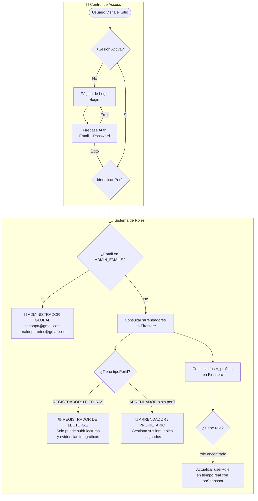
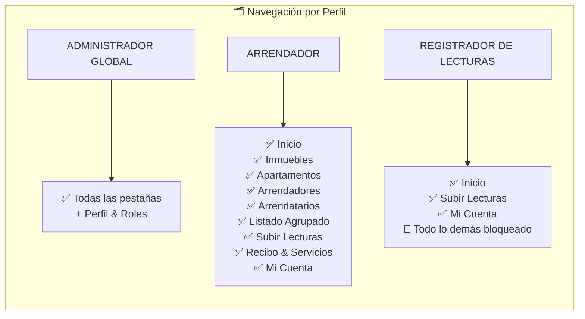
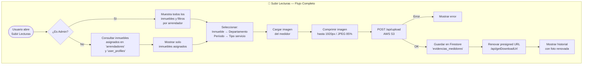
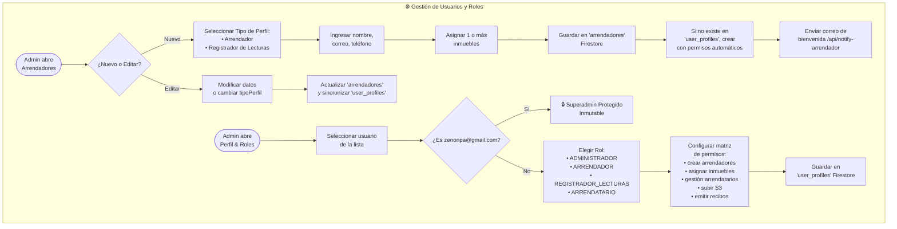
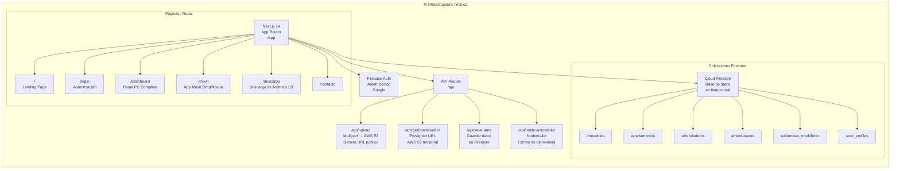

# 🏢 Diagrama de Flujo — Sistema depas.link

## Arquitectura General



## Dashboard — Navegación por Perfil



## Módulos del Sistema

```mermaid
flowchart LR
    subgraph MODULOS["📦 Módulos del Sistema"]
        direction TB

        M1["🏠 Tab Inicio\nAccesos rápidos\nresumidos por perfil"]

        M2["🏢 Tab Inmuebles\nCRUD de propiedades\nRegistro y administración\n[Solo Admin/Arrendador]"]

        M3["🏠 Tab Apartamentos\nCRUD de unidades\nContrato, inquilino,\ngarantía, precio\n[Solo Admin/Arrendador]"]

        M4["👤 Tab Arrendadores\nRegistro de usuarios:\n• Arrendador\n• Registrador de Lecturas\nAsignación de inmuebles\n[Solo Admin]"]

        M5["👥 Tab Arrendatarios\nRegistro de inquilinos\nDocumentos, residentes,\nfechas de contrato\nEditar popup drag+resize\n[Solo Admin/Arrendador]"]

        M6["📊 Tab Listado Agrupado\nVista consolidada por\ninmueble y arrendatario\n[Solo Admin/Arrendador]"]

        M7["📸 Tab Subir Lecturas\nCarga de imágenes a AWS S3\nRegistro en Firestore\nFiltrado por inmueble\nasignado al usuario\n[Todos los perfiles]"]

        M8["🧾 Tab Recibo & Servicios\nGeneración de recibos\nservicios de luz/agua/internet\n[Solo Admin/Arrendador]"]

        M9["👤 Tab Mi Cuenta\nEditar nombre,\nteléfono, cargo\n[Todos los perfiles]"]

        M10["🔒 Tab Perfil & Roles\nConfigurar rol y\npermisos por usuario\nProtección superadmin\n[Solo Administradores]"]
    end
```



## Flujo de Subida de Lecturas (TabCargaInfo)



## Flujo de Gestión de Arrendadores y Roles



## Infraestructura y API Routes



## Vista Móvil (/movil)

```mermaid
flowchart TD
    subgraph MOVIL["📱 Módulo Móvil — /movil"]
        MV1([Usuario accede\na /movil]) --> MV2[Firebase Auth\nVerificar sesión]
        MV2 -- No autenticado --> MV3[Redirigir /login]
        MV2 -- Autenticado --> MV4[Cargar perfil del usuario\nde 'arrendadores'\ny 'user_profiles']
        MV4 --> MV5{¿Es Admin?}
        MV5 -- Sí --> MV6[Mostrar todos\nlos inmuebles]
        MV5 -- No --> MV7[Filtrar solo\ninmuebles asignados]
        MV6 --> MV8[Seleccionar:\nInmueble → Período]
        MV7 --> MV8
        MV8 --> MV9[Seleccionar departamento\nfiltrado por inmueble]
        MV9 --> MV10[Capturar foto\ncámara trasera]
        MV10 --> MV11[Ingresar lectura\nkWh y descripción]
        MV11 --> MV12[Comprimir + subir\na S3 + guardar Firestore]
        MV12 --> MV13[Ver historial\nde lecturas recientes]
    end
